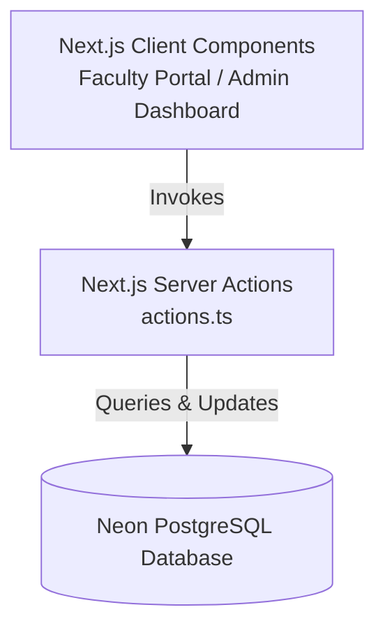

# SCSIT Computer Lab Portal: Comprehensive System Audit & Design Review

This document provides a detailed technical audit of the **SCSIT Computer Lab Portal** codebase, examining the system architecture, database structure, features, design decisions, security implementation, and current issues/lint errors.

---

## 1. System Architecture Overview

The system is a modern web application built on **Next.js 16 (App Router)** and **React 19**, styled using **Tailwind CSS v4** and **Framer Motion**, and backed by a **Neon Serverless PostgreSQL Database**.

### Key Technologies:
*   **Framework**: Next.js 16.2.9 (App Router)
*   **UI Library**: React 19.2.4, Lucide React (for icons)
*   **Animation**: Framer Motion 12.41.0
*   **Database**: Neon Serverless PostgreSQL (`@neondatabase/serverless` client)
*   **Styling**: Tailwind CSS v4 & custom stylesheet (`globals.css`)
*   **Data Export**: Excel spreadsheet exports via `xlsx` (SheetJS)

---

## 2. Micro-level System Design & Database Schema

The database relies on Neon's PostgreSQL with table initialization and migrations handled dynamically at runtime via the `initDatabase()` Server Action inside [actions.ts](file:///d:/SUAS%20Data/src/app/actions.ts).

### Database Tables:

1.  **`suas_settings`**:
    *   *Purpose*: Stores configuration parameters as key-value pairs (e.g. active academic sessions, whether the notice ticker is shown, whether lab allocation is enabled by faculty, and toggles for modules).
    *   *Keys*: `installation_status_enabled`, `active_session`, `notice_text`, `faculty_lab_selection_enabled`, `module_*` (12 modules).

2.  **`suas_admins`**:
    *   *Purpose*: Manages administrative users, roles, assigned labs, and credentials.
    *   *Columns*: `id` (PK), `name`, `email`, `mobile`, `assigned_labs` (comma-separated list), `role` (e.g., Director Admin, Lab Assistant, Practice Trainer), `password`, `pin_hash` (for Quick PIN login), `profile_photo`, `status` (Active/Locked), `failed_login_attempts`, `locked_until`, `created_at`.

3.  **`suas_submissions`**:
    *   *Purpose*: Stores faculty requests for software installations.
    *   *Columns*: `id` (Serial PK), `submission_id` (Unique ID), `faculty_name`, `faculty_email`, `faculty_mobile` (Encrypted), `department`, `semester`, `subjects` (JSONB storing array of subjects and required software items), `signature_data` (Base64 data URL), `created_at`.
    *   *Indexes*: GIN Index `idx_suas_submissions_subjects` on the `subjects` JSONB column for optimized lookup queries.

4.  **`suas_laboratories`**:
    *   *Purpose*: Declares the 9 physical computer labs (Lab A through Lab I) inside SCSIT, including capacities and default staff assignments.
    *   *Columns*: `id` (Serial PK), `name`, `code` (Unique), `series_prefix`, `building`, `floor`, `location`, `seating_capacity`, `total_computers`, `operating_system`, `primary_purpose`, `lab_in_charge`, `lab_assistant`, `status`, `starting_number`, `current_number`, `max_capacity`.

5.  **`suas_lab_softwares`**:
    *   *Purpose*: Keeps records of software packages installed on computers in each laboratory.
    *   *Columns*: `id`, `lab_id` (FK), `software_name`, `version`, `framework`, `framework_version`, `license_type`, `installation_date`, `last_updated_date`, `installed_by`, `axn_request_id`, `remarks`.

6.  **`suas_maintenance_log`**:
    *   *Purpose*: Logs individual PC hardware issues, repair requests, status, and technician actions.
    *   *Columns*: `id`, `maintenance_id` (Unique), `lab_id` (FK), `pc_number`, `system_make`, `system_model`, `serial_number`, `date`, `time_stamp`, `issue_description`, `reason_for_damage`, `action_taken`, `technician_name`, `status` (Pending/Resolved), `completion_date`, `remarks`.

7.  **`suas_inventory`**:
    *   *Purpose*: Tracks devices and specifications (CPUs, RAM, Monitor, Projector, UPS details) in each lab.

8.  **`suas_assets_lifecycle`**:
    *   *Purpose*: Monitors hardware lifecycle, warranty expiry dates, AMC details, and replacement recommendations.

9.  **`suas_naac_docs`** & **`suas_ieee_compliance`** & **`suas_document_repository`**:
    *   *Purpose*: File storage metadata tables for compliance, audit reviews, and general repository access.

10. **`suas_audit_logs`**:
    *   *Purpose*: Real-time audit trails of admin-initiated modifications.
    *   *Columns*: `id`, `username`, `action_performed`, `table_name`, `record_id`, `previous_value`, `updated_value`, `timestamp`.

---

## 3. Function & Feature Analysis

### Faculty Interface (`src/app/page.tsx`)
*   **Multi-Step Submission Wizard**:
    1.  *Faculty Info*: Name, official email, mobile, department selection, and target semester.
    2.  *Software Builder*: Add/edit/delete rows of required software, versions, and frameworks/stacks, supported by preset autocomplete suggestions.
    3.  *Digital Sign-off*: Custom Signature Pad component capture and confirmation.
*   **Submission Status Tracking**: Faculty can search using their email, mobile, or Submission ID to see the installation progress ("Pending", "In Progress", "Installed") and admin remarks.

### Administrative Interface (`src/app/admin`)
*   **Secure Authentication**:
    *   Dual login methods: Classic Password Login and Rapid 4-8 digit numeric PIN Login.
    *   Interactive PIN configuration modal during first login.
*   **Operational Modules**:
    *   *Faculty Software Requests*: View, print, modify status, and update installation remarks.
    *   *Laboratory Management*: Setup labs, prefixes, systems count, and assign in-charges.
    *   *Inventory & Lifecycle*: Track device configurations, warranties, and AMC schedules.
    *   *Maintenance Register*: Submit and update repair issues for machines.
    *   *Excel Reports & Logs*: Export all submissions, logs, inventory, and compliance records directly to `.xlsx` sheets.
    *   *Security Audit Logs*: Detailed view of who changed what table value and when, with clear options.

### Security Mechanisms (`src/app/actions.ts`)
*   **Crypto Helpers**:
    *   `hashValue()`: SHA-256 password hashing.
    *   `encrypt()` & `decrypt()`: AES-256-CBC encryption for sensitive values (such as faculty mobile numbers).

---

## 4. System Audit: Issues, Warnings, & Bugs

A comprehensive build and code quality analysis was executed on the workspace using TypeScript compiler validation and ESLint syntax analysis.

### Build and Compilation Status
> [!NOTE]
> Running TypeScript compiler checking (`npx tsc --noEmit`) returns **0 errors**. The code compiles cleanly with no static typing issues.

### ESLint Inspection Results
> [!WARNING]
> ESLint checking (`npm run lint`) reported **271 issues (198 errors, 73 warnings)**. 

#### Major Issue Categories:

1.  **React State Update Side-effects** (`react-hooks/set-state-in-effect`):
    *   *Location*: `src/components/SignaturePad.tsx` (Lines 31, 58)
    *   *Description*: State setters (`setHasSigned`) are invoked synchronously inside `useEffect` callback bodies without conditions or wrapper callbacks, causing cascading render passes.
    *   *Remedy*: Re-evaluate state calculation during the render phase or trigger state changes inside input event handlers instead of effect cycles.

2.  **Usage of Explicit `any` Types** (`@typescript-eslint/no-explicit-any`):
    *   *Location*: `src/app/actions.ts`, `src/app/page.tsx`, and `src/app/admin/page.tsx`
    *   *Description*: Broad usage of `any` disables TypeScript's safety features and obscures compile-time checks, particularly inside server actions handling database returns and JSON configurations.

3.  **HTML `` tag usages** (`@next/next/no-img-element`):
    *   *Location*: Profile photo previews inside the admin panel.
    *   *Description*: Direct HTML `` elements bypass Next.js image optimizations.
    *   *Remedy*: Replace with Next.js `<Image />` component.

---

## 5. Summary Recommendation

The SCSIT Computer Lab Portal is well-structured, featuring robust database schemas and modular UI components. To prepare the codebase for production stability and compliance with standards, the following steps are recommended:
1.  **Refactor SignaturePad State Sync**: Remove synchronous `setState` calls from the effect hook inside [SignaturePad.tsx](file:///d:/SUAS%20Data/src/components/SignaturePad.tsx).
2.  **Strongly Type Server Action Returns**: Replace implicit `any` definitions in database queries inside [actions.ts](file:///d:/SUAS%20Data/src/app/actions.ts) with strict TypeScript interfaces.
3.  **Resolve Image Optimization Warning**: Swap `` tags inside [admin/page.tsx](file:///d:/SUAS%20Data/src/app/admin/page.tsx) with standard `next/image` components.
